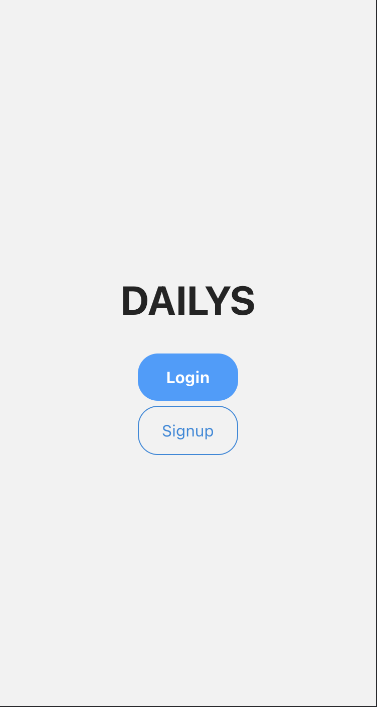
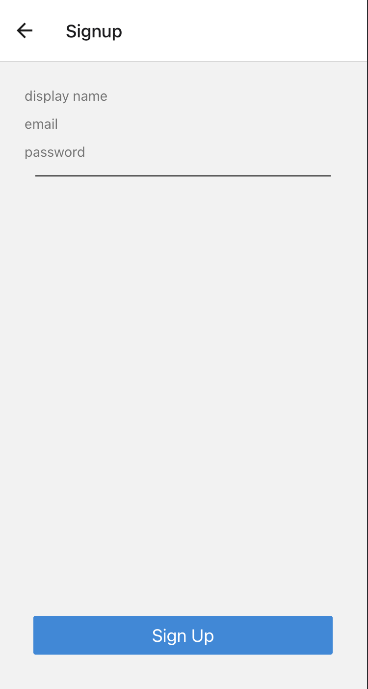
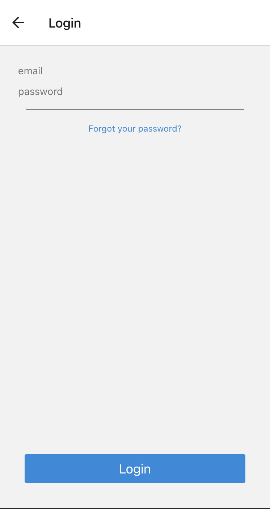
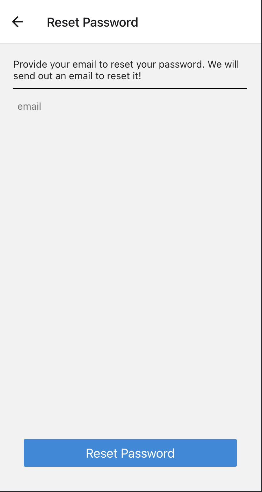
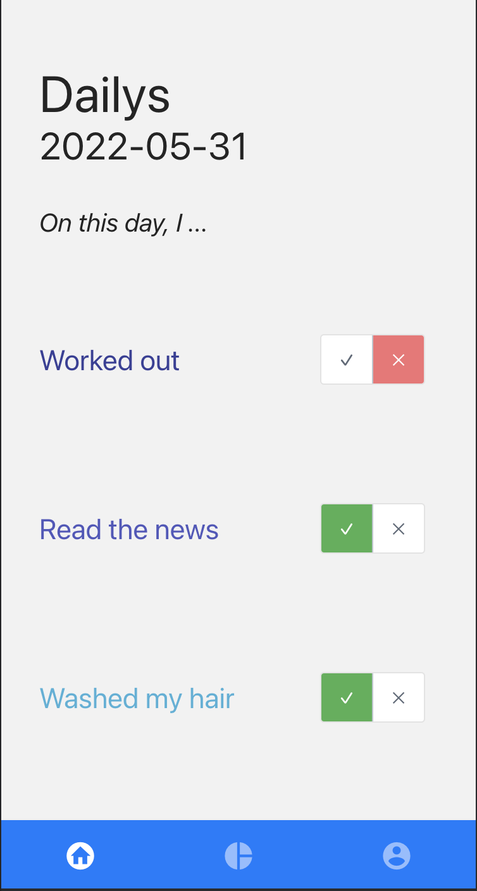
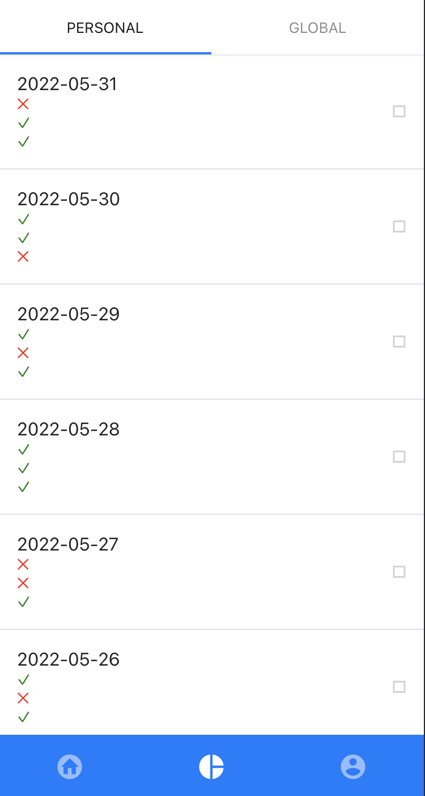
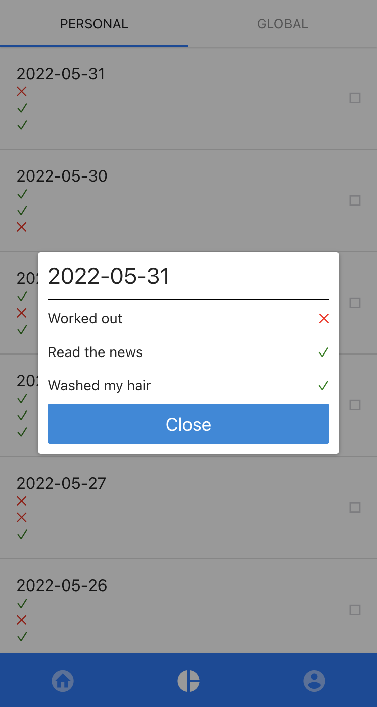
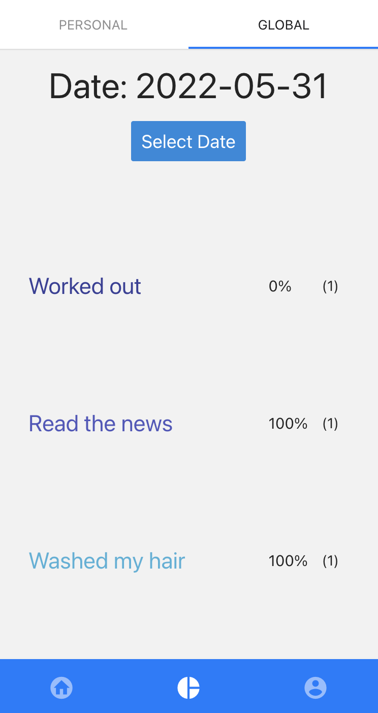
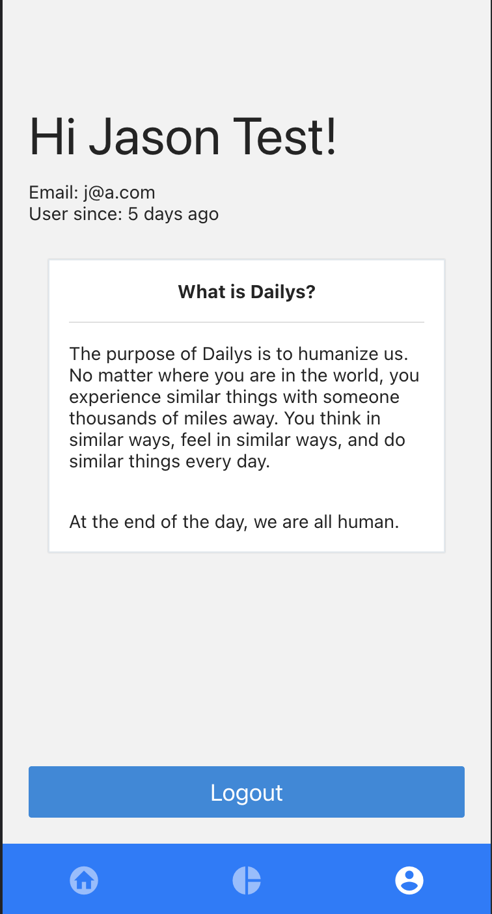

# Dailys

## Development

```
expo start
# for web
w
```

## Built with
* React/React Native (Component based UI framework)
* React Navigation (React Native navigation)
* Redux (global store)
* React Native Elements (React Native components)
* Firebase - Firestore (DB store)

## Screens

`LaunchScreen`



`Signup`



`Login`



`ForgotPassword`



`HomeScreen`



`StatsScreen > PersonalStats`



`StatsScreen > PersonalStats > DailyOverlay`



`StatsScreen > GlobalStats`



`ProfileScreen`


